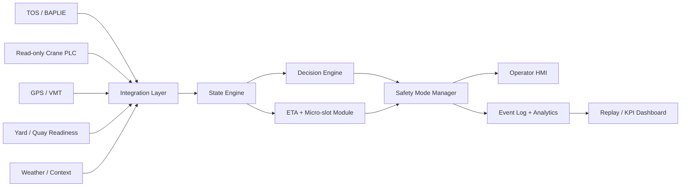

# ZERO-WAIT STS Complete Project Plan

## 1. Executive Summary

ZERO-WAIT STS is an advisory coordination layer for ship-to-shore crane operations. It is designed to reduce inter-cycle dwell time by preparing the next executable move before the current crane move finishes.

The project has two parallel tracks:

1. **Demonstration track**
   Keep the public 3D storyboard, synthetic MVP console, and replay visuals for jury presentations, stakeholder walkthroughs, and early product explanation.

2. **Operational product track**
   Build a real advisory system that reads terminal data, crane state, vehicle telemetry, yard readiness, and context feeds; ranks executable next moves; assigns trucks to micro-slots; keeps fallback moves ready; shows the operator a recommendation; and logs every decision for KPI proof.

The first real pilot must be advisory-only:

- no PLC writes,
- no certified crane-control changes,
- no automatic crane actuation,
- no override of existing safety systems,
- operator remains fully in control.

The correct delivery sequence is:

```text
Requirements and data mapping
-> synthetic digital twin
-> decision engine MVP
-> offline replay validation
-> shadow mode
-> advisory pilot
-> scale-out
```

## 2. Problem Statement

STS crane cycle time has already been heavily optimized mechanically through faster hoists, trolley drives, anti-sway systems, and improved crane controls. A remaining loss occurs between moves: the crane is ready, but the next executable operation is not.

This inter-cycle dwell time appears when:

- the next ITV or AGV is late,
- the vehicle is in the wrong lane,
- the next container is blocked by a vessel dig or restow,
- a twin-lift partner is not ready,
- a twistlock or pinning issue appears,
- the operator has to manually resolve uncertainty,
- the TOS plan does not match live quay reality.

ZERO-WAIT STS addresses the live execution gap between the TOS plan and the physical crane/truck operation. It does not replace the TOS. It checks whether the planned move is executable right now and prepares a fallback before the crane reaches idle.

## 3. Scope And Boundaries

### In Scope

- Read-only integration with TOS/BAPLIE, crane PLC state, vehicle telemetry, yard/quay readiness, and weather/context feeds.
- Live state engine for crane, vehicles, move candidates, lane/slot status, and feed freshness.
- Look-ahead ranking for the next 2-3 candidate moves.
- Compatibility checks between containers and vehicles/chassis.
- ETA prediction and micro-slot advisory.
- Dynamic resequencing when the planned move is blocked, late, incompatible, or uncertain.
- Operator HMI for recommendations, fallback visibility, feed health, safety mode, and event logs.
- Offline replay, shadow mode, advisory pilot, and KPI analytics.
- Synthetic digital twin for development and demonstration without real port data.

### Out Of Scope For First Pilot

- Direct crane commands.
- PLC writes.
- Automatic vehicle control unless separately approved by the terminal.
- Certified safety PLC changes.
- Full terminal automation.
- Replacing the TOS.
- Removing operator authority.

## 4. Safety Boundary

ZERO-WAIT STS must be implemented as a decision-support system.

Safety principles:

- The system reads crane state but never controls the crane.
- The system provides recommendations, not actuation commands.
- The operator can accept, ignore, or override every recommendation.
- Feed loss or low confidence must degrade the system state instead of forcing automation.
- Existing terminal procedures remain available at all times.

Safety modes:

| Mode | Condition | Behavior |
| --- | --- | --- |
| Coordinated | All critical feeds healthy and confidence high | Show confirmed next move and micro-slot instruction |
| Recommendation | Non-critical feed stale or uncertainty present | Show recommendation with explicit confirmation requirement |
| Manual | Critical feed loss, sensor dropout, or unsafe uncertainty | Step back and require operator/manual completion |

Critical degradation examples:

- PLC feed unavailable -> Manual.
- GPS/VMT unavailable -> Manual or Recommendation depending on local procedure.
- TOS stale -> Recommendation.
- Yard readiness stale -> Recommendation.
- Slot camera/proximity confidence low -> Manual.
- Operator rejects recommendation -> Manual or operator-selected fallback.

## 5. Required Data

Minimum real-port data requirements:

| Source | Required Data | Target Freshness |
| --- | --- | --- |
| TOS / BAPLIE | container ID, ISO size/type, weight, bay-row-tier, move sequence, load/discharge direction, priority, twin-lift pair, special handling | per vessel call plus live updates |
| Crane PLC read-only | hoist height, trolley position, spreader state, twistlock state, load cell, anti-sway/damping, move start/end, landing/release events | 100-500 ms |
| Vehicle / VMT / GPS | ITV/AGV ID, chassis type, position, speed, lane, assignment, ETA, loaded/empty state, availability | around 1 s |
| Yard / quay readiness | lane occupancy, slot availability, blocked handoff points, vessel dig/restow status, pinning/twistlock exceptions, reefer readiness | 1-5 s |
| Weather/context | wind speed, gusts, visibility, handling restrictions | 5-15 s |
| Operator action log | recommendation shown, accepted, ignored, overridden, reason, manual fallback event | event based |
| KPI ground truth | actual cycle time, idle gap, vehicle arrival accuracy, fallback activations, moves/hour | event based |

## 6. Canonical Data Contracts

The same contracts should be used for synthetic data, offline replay, shadow mode, and real pilot integrations.

```ts
Container {
  id: string
  iso: "20GP" | "40HC" | "40RF" | "45HC" | string
  sizeFt: number
  weightTonnes: number
  bayRowTier: string
  requiredChassis: string
  specialHandling: string[]
}

Move {
  id: string
  sequence: number
  containerId: string
  plannedVehicleId: string
  fallbackVehicleIds: string[]
  operation: "load" | "discharge"
  priority: number
  twinLift: boolean
  status: "available" | "blocked_source_bay" | "completed" | "held"
}

CraneState {
  craneId: string
  activeMoveId: string
  hoistHeightMeters: number
  trolleyPosition: string
  spreaderLocked: boolean
  twistlockState: "open" | "locked" | "unknown"
  loadCellTonnes: number
  antiSwayMeters: number
  triggerActive: boolean
  timestamp: string
}

VehicleState {
  vehicleId: string
  chassisType: string
  compatibleIso: string[]
  lane: string
  slot: string
  position: { x: number, y: number }
  speedKmh: number
  etaSeconds: number
  loaded: boolean
  available: boolean
}

YardState {
  targetSlot: string
  slotAvailable: boolean
  laneOccupancy: Record<string, string>
  blockedBays: string[]
  exceptions: string[]
}

Recommendation {
  moveId: string
  containerId: string
  vehicleId: string
  lane: string
  slot: string
  arrivalWindow: string
  score: number
  safetyMode: "Coordinated" | "Recommendation" | "Manual"
  reasons: string[]
}

OperatorAction {
  recommendationId: string
  action: "accepted" | "ignored" | "overridden"
  overrideReason?: string
  timestamp: string
  operatorId?: string
}

Outcome {
  moveId: string
  actualVehicleId: string
  idleSeconds: number
  cycleSeconds: number
  handoffCompleted: boolean
  manualFallback: boolean
  timestamp: string
}
```

## 7. Product Architecture



### Integration Layer

Purpose:

- connect to each source system,
- normalize external payloads into canonical events,
- attach source timestamps and ingestion timestamps,
- calculate freshness and data quality,
- reject malformed payloads before they enter the state engine.

Likely connectors:

- TOS/BAPLIE: API, database read replica, scheduled export, or file parser.
- PLC: read-only OPC-UA or Modbus through an edge gateway.
- GPS/VMT: REST, MQTT, WebSocket, or database feed.
- Yard readiness: TOS module, yard planning export, manual status feed, or API.
- Weather: local mast API or terminal weather feed.

### State Engine

Purpose:

- maintain the latest trusted operational snapshot,
- track current crane operation,
- hold next candidate moves,
- maintain vehicle positions and lane/slot occupancy,
- mark feed freshness and confidence,
- expose a deterministic input snapshot to the decision engine.

The state engine should be deterministic: the same event sequence should produce the same state snapshot.

### Decision Engine

Purpose:

- evaluate next 2-3 moves,
- score readiness,
- reject impossible or unsafe options,
- promote fallback moves,
- produce explainable recommendations under the latency target.

Scoring inputs:

- container accessibility,
- vehicle ETA,
- lane/slot status,
- chassis compatibility,
- weight/load class,
- reefer/special handling,
- twin-lift readiness,
- vessel dig/restow status,
- twistlock/pinning exception,
- weather/damping profile,
- feed confidence.

### ETA And Micro-Slot Module

Purpose:

- predict short-horizon vehicle arrival,
- assign lane and slot,
- calculate arrival tolerance window,
- produce a driver/VMT instruction.

Example output:

```text
ITV-115 -> Lane 2 / Slot B / target arrival T-minus 8s
```

### Safety Mode Manager

Purpose:

- enforce the advisory-only boundary,
- degrade behavior when confidence is low,
- prevent recommendations from appearing more certain than the data supports.

### Operator HMI

Purpose:

- show the operator what matters now,
- reduce checking time,
- keep authority with the operator.

Minimum HMI zones:

- current execution,
- confirmed next move,
- fallback readiness,
- vehicle/micro-slot status,
- feed health,
- safety mode,
- operator action buttons,
- event log.

### Replay And Analytics

Purpose:

- prove value before live advisory deployment,
- compare recommendations against actual operations,
- calculate idle-time recovery and moves/hour impact,
- support tuning and audit.

## 8. Implementation Roadmap

### Phase 0: Project Setup And Governance

Tasks:

- Confirm stakeholder roles: terminal operations, crane engineering, IT/OT, safety, operator representatives.
- Confirm advisory-only boundary.
- Define accessible systems and protocols.
- Define pilot crane, vessel-call type, KPI baseline period, and approval process.
- Produce final signed data map and safety boundary document.

Exit criteria:

- target crane selected,
- data owners identified,
- read-only PLC access approved in principle,
- KPI baseline method agreed,
- safety boundary accepted.

### Phase 1: Data Discovery And Mapping

Tasks:

- Collect sample TOS/BAPLIE files or API payloads.
- Collect sample PLC signal list, tags, meanings, and update rates.
- Collect GPS/VMT sample payloads.
- Map quay coordinates: crane, vessel bay, lanes, slots, yard blocks.
- Define NTP time synchronization requirements.
- Map terminal-specific codes to canonical contracts.

Exit criteria:

- sample payloads stored,
- canonical mapping table completed,
- missing fields documented,
- coordinate system defined,
- minimum viable feed list agreed.

### Phase 2: Synthetic Digital Twin

Tasks:

- Build synthetic vessel plans, moves, containers, crane cycles, truck movement, yard exceptions, weather, and sensor dropouts.
- Simulate:
  normal operation, late truck, wrong lane, vessel dig, twin-lift mismatch, twistlock issue, sensor dropout, stale TOS, GPS loss, high wind.
- Feed synthetic events through the same contracts intended for real data.
- Keep pitch simulator and implementation console connected to synthetic data.

Exit criteria:

- synthetic data covers all major failure modes,
- engine consumes synthetic and real-shaped payloads,
- replay mode produces KPI outputs,
- jury demo remains available without port access.

### Phase 3: Decision Engine MVP

Tasks:

- Implement PLC trigger logic from hoist height, trolley position, spreader/twistlock state, load cell, and anti-sway.
- Rank next 2-3 candidate moves.
- Check vehicle/container compatibility.
- Check ETA and lane readiness.
- Promote fallback when planned move is late, blocked, incompatible, or uncertain.
- Produce recommendation under 200 ms after trigger.

Exit criteria:

- unit tests pass,
- synthetic replay produces stable recommendations,
- incompatible trucks are rejected,
- fallback recommendations are explainable,
- latency target is met.

### Phase 4: Micro-Slot And VMT Advisory

Tasks:

- Convert recommendation into vehicle instruction:
  vehicle ID, lane, slot, ETA countdown, target arrival window.
- Add hold, proceed, and manual states.
- Keep dispatch advisory-only unless terminal explicitly approves write-back to VMT.
- Log every advisory and vehicle outcome.

Exit criteria:

- micro-slot instruction generated for every executable move,
- late vehicle cases handled,
- fallback vehicle assignment visible,
- incompatible vehicle assignments blocked,
- advisory messages are logged.

### Phase 5: Operator HMI

Tasks:

- Build operational dashboard separate from the pitch simulator.
- Show current execution, next recommendation, fallback, vehicle readiness, feed health, safety mode, and event log.
- Use traffic-light status: green ready, yellow uncertain, red manual/fallback.
- Add replay mode for historical/synthetic vessel calls.
- Make operator override easy and logged.

Exit criteria:

- operator can identify current move, next move, fallback, and safety mode within seconds,
- override reason is captured,
- HMI supports live and replay modes,
- visual design does not overload the operator.

### Phase 6: Offline Replay Validation

Tasks:

- Replay historical vessel calls if available.
- Compare ZERO-WAIT recommendation timeline against actual operation.
- Measure theoretical idle saved and wrong recommendation risk.
- Tune thresholds for ETA, readiness, freshness, and fallback promotion.

Exit criteria:

- replay report generated,
- recommendation accuracy measured,
- false positive and false fallback cases reviewed,
- candidate pilot thresholds selected.

### Phase 7: Shadow Mode

Tasks:

- Run live beside one STS crane.
- Do not show recommendations to operators yet.
- Log what ZERO-WAIT would have recommended.
- Compare against actual operator/planner decisions.
- Check feed latency, clock sync, GPS lane accuracy, and PLC trigger stability.

Exit criteria:

- system runs reliably during live operations,
- no operational impact,
- recommendation quality reviewed,
- safety degradation works under feed loss,
- operations team approves advisory exposure.

### Phase 8: Advisory Pilot

Tasks:

- Show recommendations to operator.
- Allow operator to accept, ignore, or override.
- Maintain no direct crane control.
- Measure real idle reduction, override rate, micro-slot accuracy, and operator feedback.
- Review safety events and manual fallback transitions.

Exit criteria:

- 10-20% inter-move idle reduction target evaluated,
- 5-8% moves/hour improvement target evaluated,
- vehicle on-time accuracy above 80%,
- override rate trending below 30% after tuning,
- operator feedback collected.

### Phase 9: Scale-Out

Tasks:

- Configure additional cranes using first-crane integration blueprint.
- Add multi-crane vehicle conflict detection.
- Add richer yard readiness integration.
- Add fleet-level analytics and energy/load smoothing.
- Move from SQLite to Postgres if multi-crane volume requires it.

Exit criteria:

- second crane configured faster than first,
- cross-crane conflicts visible,
- fleet KPI dashboard available,
- production monitoring active.

## 9. Testing Strategy

| Test Type | Purpose | Examples |
| --- | --- | --- |
| Unit tests | Verify core logic | scoring, compatibility, fallback promotion, PLC trigger, ETA, safety mode |
| Contract tests | Verify adapter payloads | TOS, BAPLIE, PLC, GPS/VMT, yard, weather samples |
| Synthetic scenario tests | Validate operational behavior | normal, late truck, wrong lane, vessel dig, twistlock, twin-lift mismatch, sensor dropout |
| Latency tests | Prove responsiveness | recommendation under 200 ms after trigger |
| Replay tests | Compare against ground truth | actual timeline versus recommendation timeline |
| Safety tests | Verify degradation | PLC/GPS/TOS/yard loss moves to Recommendation or Manual |
| HMI tests | Verify usability | operator sees next move, fallback, safety state quickly |
| Pilot acceptance tests | Verify value | idle reduction, moves/hour gain, micro-slot accuracy, override rate |

Minimum pilot targets:

- 6-10% average cycle-time reduction,
- 5-8% moves/hour improvement,
- 10-20% inter-move idle reduction,
- vehicle micro-slot accuracy above 80%,
- operator override rate below 30% after tuning,
- recommendation latency below 200 ms.

## 10. Visualization Plan

The project should use four separate visualization surfaces:

| Surface | Audience | Purpose |
| --- | --- | --- |
| Pitch simulator | Judges, stakeholders | Explain the full ZERO-WAIT concept visually |
| Implementation MVP console | Technical evaluators | Show synthetic feeds, ranking, fallback, micro-slot, safety mode, and logs |
| Operational HMI | Crane operator / terminal pilot | Support real advisory operation |
| Replay and analytics dashboard | Operations, management, project team | Validate KPIs and tune recommendations |

The pitch simulator should remain clear and presentation-focused. The operational HMI should be quieter, denser, and built for repeated use by operators.

## 11. Synthetic-Only Delivery Path

If no real port data is available, the team can still complete:

- canonical data model,
- synthetic TOS/BAPLIE generator,
- synthetic PLC stream,
- synthetic GPS/VMT stream,
- synthetic yard/weather feeds,
- decision engine,
- ETA and micro-slot module,
- fallback and safety modes,
- operator dashboard prototype,
- replay viewer,
- analytics,
- Docker deployment,
- public demo.

This is a realistic 70-80% software prototype.

What remains unproven without real terminal data:

- actual idle-time reduction,
- real PLC latency and signal behavior,
- GPS lane accuracy,
- real TOS integration complexity,
- operator acceptance,
- true exception frequency,
- terminal safety approval,
- real ROI, energy, and emissions impact.

## 12. Deployment Plan

### Prototype Deployment

- React/Vite frontend.
- Node or Python backend.
- SQLite.
- Synthetic data generator.
- Local Docker Compose.
- Browser-based dashboard.

### Single-Crane Pilot Deployment

- Docker container on industrial edge PC.
- Read-only PLC adapter.
- TOS/BAPLIE adapter.
- GPS/VMT adapter.
- WebSocket stream to dashboard.
- SQLite or Postgres.
- NTP time sync.
- Local event log export.

### Production Deployment

- Postgres.
- Centralized logging.
- Multi-crane configuration.
- Role-based access.
- Dashboard authentication.
- Monitoring and alerting.
- Daily KPI export.
- Backup and retention policy.

## 13. Risks And Mitigations

| Risk | Impact | Mitigation |
| --- | --- | --- |
| Poor GPS lane accuracy | Wrong micro-slot confidence | Calibrate lane map, use VMT lane state, degrade confidence when uncertain |
| PLC access limitations | Weak trigger signal | Use read-only gateway, minimum tag list, shadow mode before advisory |
| TOS latency | Stale plan | Use freshness scoring and Recommendation/Manual degradation |
| Wrong fallback recommendation | Operator distrust | Compatibility checks, replay validation, override logging, no direct control |
| Operator overload | Low adoption | Show decision context only, avoid raw data overload |
| Safety approval delay | Pilot delay | Maintain advisory-only boundary and document no-control architecture |
| Weak historical data | Harder validation | Use synthetic replay first, then shadow mode live logging |
| Coordinate calibration errors | Wrong lane/slot assignment | Survey quay coordinates and validate with live vehicle traces |

## 14. Project Timeline

Indicative timeline for a first working pilot:

| Stage | Duration | Output |
| --- | --- | --- |
| Setup and data discovery | 2-4 weeks | data map, safety boundary, sample payloads |
| Synthetic twin and MVP engine | 3-5 weeks | replayable synthetic system and decision engine |
| Offline replay | 2-4 weeks | threshold tuning and validation report |
| Shadow mode | 4-8 weeks | live comparison with no operator exposure |
| Advisory pilot | 4-8 weeks | operator-facing recommendations and KPI evaluation |
| Scale-out | after pilot | more cranes and fleet analytics |

The synthetic-only version can move faster because it does not require terminal access approvals. A real terminal pilot depends most heavily on data access, OT safety review, and operator availability.

## 15. Roles And Responsibilities

| Role | Responsibility |
| --- | --- |
| Product/project lead | scope, stakeholder alignment, pilot criteria |
| Terminal operations lead | operational rules, acceptance, operator feedback |
| Crane/OT engineer | PLC signal access, safety boundary, edge deployment |
| TOS/data engineer | TOS/BAPLIE access and field mapping |
| Backend engineer | connectors, state engine, decision engine, storage |
| Frontend engineer | operator HMI, replay dashboard, visual QA |
| Data/analytics engineer | KPI definitions, replay analytics, ROI calculations |
| Safety representative | advisory boundary and pilot safety review |

## 16. Success Criteria

The project is successful if it can demonstrate all of the following:

- The system reads real or synthetic feeds into one canonical state.
- It ranks the next executable move before the current move ends.
- It assigns vehicles to clear micro-slots with arrival windows.
- It rejects incompatible truck/container matches.
- It promotes fallback moves before the crane reaches idle.
- It degrades safely to Recommendation or Manual mode under uncertainty.
- Operators can understand and override recommendations.
- Every recommendation and outcome is logged.
- Replay or pilot results show measurable idle-time recovery.

## 17. Current Repository Status

The repository already contains:

- public 3D pitch simulator,
- synthetic implementation MVP console,
- canonical synthetic contracts,
- synthetic feed generator,
- advisory decision engine,
- engine unit tests,
- MVP summary documentation.

This document is the complete blueprint for moving from the current synthetic MVP toward a real advisory pilot.

